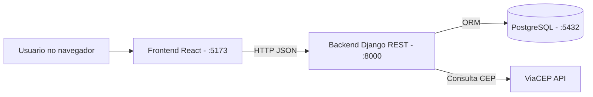

# Dia Leve (Todo App)


Aplicacao full stack para gerenciamento de tarefas, com autenticacao JWT, categorias, filtros, compartilhamento de tarefas e interface web moderna para login/cadastro e dashboard.

## Ambiente de producao

- Frontend (Vercel): https://todo-list-tc.vercel.app/
- Backend (Railway): https://todo-list-tc-production.up.railway.app/
- API base em producao: https://todo-list-tc-production.up.railway.app/api

## 1. Visao geral

O projeto esta dividido em:

- `backend/`: API REST com Django + DRF + PostgreSQL.
- `frontend/`: SPA em React + Vite consumindo a API.
- `docker-compose.yml`: orquestracao local de banco, backend e frontend.

## 2. Principais funcionalidades

- Cadastro de usuario.
- Login com JWT (access + refresh token).
- Endpoint de usuario autenticado (`/api/auth/me/`).
- CRUD de tarefas.
- Edicao de tarefas inline (titulo, descricao, prioridade e categoria).
- CRUD de categorias por usuario.
- Compartilhamento de tarefas com outros usuarios.
- Filtros de tarefas (status, categoria, prioridade, busca, paginacao).
- Integracao com ViaCEP (`/api/address/{cep}/`).
- Widget de clima por CEP (ViaCEP + OpenWeatherMap).
- Mini calendario no dashboard com marcacao de dias com prazo (`due_date`).
- Sistema de temas com 3 opcoes visuais (Kawaii, Classico e Energia), com seletor no login e no dashboard.
- Interface frontend com fluxos de autenticacao e dashboard completos.

## 3.1 Decisoes de design e arquitetura

Principais decisoes adotadas no projeto:

- Arquitetura em camadas no backend:
  - ViewSets para orquestracao HTTP.
  - Serializers para validacao e transformacao de dados.
  - Models para regras de persistencia.
  - Integracao externa isolada em `tasks/integrations.py`.
- Frontend com separacao por responsabilidade:
  - `services/` para acesso HTTP.
  - `hooks/` para estado e regras de fluxo.
  - `pages/` para composicao de tela.
  - `components/` para elementos reutilizaveis.
- Personalizacao de experiencia:
  - temas controlados por provider global,
  - tokens CSS por tema para manter consistencia visual,
  - persistencia da escolha no `localStorage`.
- Seguranca e autorizacao:
  - JWT para autenticacao stateless.
  - Permissoes de dono e usuario compartilhado nas tarefas.
- Principios aplicados:
  - KISS: endpoints e fluxos diretos, sem acoplamento desnecessario.
  - DRY: centralizacao de API client e hooks reutilizaveis.
  - SOLID (aplicado de forma pragmatica): responsabilidade unica por modulo.
- Testabilidade:
  - Pytest com cenarios de autorizacao, filtros e integracao externa com mock.
  - Selenium E2E cobrindo fluxos essenciais do frontend.

## 3. Arquitetura



## 4. Tecnologias

### Backend

- Python 3.13
- Django 6 + Django REST Framework
- Simple JWT
- PostgreSQL 16
- Pytest

### Frontend

- React 19
- Vite 8
- Axios
- Jest + Selenium WebDriver (E2E)

### Infra

- Docker
- Docker Compose
- GitHub Actions (pipeline de CI)

## 5. Requisitos

Para executar localmente com Docker:

- Docker Desktop ou engine Docker + Compose plugin

Para executar sem Docker:

- Python 3.13+
- Node.js 20+
- npm 10+
- PostgreSQL 16+

## 6. Subir o projeto com Docker (recomendado)

Na raiz `todo-app`:

```bash
docker compose up --build
```

Para executar em background:

```bash
docker compose up -d --build
```

Servicos esperados:

- Frontend: `http://localhost:5173`
- Backend API: `http://localhost:8000/api/`
- Admin Django: `http://localhost:8000/admin/`
- PostgreSQL: `localhost:5432`

## 7. Configuracao de ambiente

### Backend

Crie o arquivo de ambiente a partir do template:

```powershell
Copy-Item .\backend\.env.example .\backend\.env
```

O `docker-compose.yml` da raiz ja carrega esse arquivo no servico `backend`.

## 8. Comandos uteis (raiz)

Aplicar migracoes:

```bash
docker compose exec backend python manage.py migrate
```

Criar superusuario (opcional):

```bash
docker compose exec backend python manage.py createsuperuser
```

Ver logs do backend:

```bash
docker compose logs -f backend
```

Parar servicos:

```bash
docker compose down
```

## 9. Testes

### Backend (Pytest)

```bash
docker compose run --rm backend pytest tests/ -v
```

### Frontend E2E (Jest + Selenium)

Requisitos:

- Backend em execucao
- Frontend em execucao
- Google Chrome instalado

Comando:

```bash
cd frontend
npm run test:e2e
```

## 10. API (resumo)

Base URL local:

- `http://localhost:8000/api`

Base URL producao:

- `https://todo-list-tc-production.up.railway.app/api`

Autenticacao:

- `POST /api/auth/register/`
- `POST /api/auth/login/`
- `POST /api/auth/token/refresh/`
- `GET /api/auth/me/`

Recursos:

- `GET/POST /api/tasks/`
- `GET/PATCH/PUT/DELETE /api/tasks/{id}/`
- `POST /api/tasks/{id}/share/`
- `GET/POST /api/categories/`
- `GET/PATCH/PUT/DELETE /api/categories/{id}/`
- `GET /api/address/{cep}/`

## 11. Deploy e estrategia de entrega

Deploy publicado para demonstracao:

- Frontend em Vercel: https://todo-list-tc.vercel.app/
- Backend em Railway: https://todo-list-tc-production.up.railway.app/

Detalhes de arquitetura de deploy:

- Backend publicado via Dockerfile no Railway (configurado em `backend/railway.toml`).
- Healthcheck do backend em `/healthz/` e rota raiz `/` retornando status de aplicacao.
- Frontend configurado para:
  - usar `VITE_API_BASE_URL` quando definida,
  - usar backend Railway automaticamente em build de producao,
  - manter `http://localhost:8000/api` no desenvolvimento local.

Essa estrategia garante reproducibilidade local (Docker Compose) e tambem uma URL publica para avaliacao funcional.

## 12. Estrutura de diretorios

```text
todo-app/
  docker-compose.yml
  backend/
    manage.py
    requirements.txt
    accounts/
    tasks/
    core/
    tests/
  frontend/
    package.json
    src/
    tests/
```

## 13. Documentacao especifica

- Backend: `backend/README.md`
- Frontend: `frontend/README.md`

## 14. Autor

Desenvolvido por Lenon Merlo para teste tecnico.

## 15. Proximas evolucoes planejadas

- Recuperacao de senha via email (token de reset + SMTP)
- Notificacoes por email quando tarefa vence
- Subtarefas
- App mobile com React Native (reaproveitando a mesma API)
- PWA para instalacao no celular
- Modo colaborativo em tempo real via WebSocket
